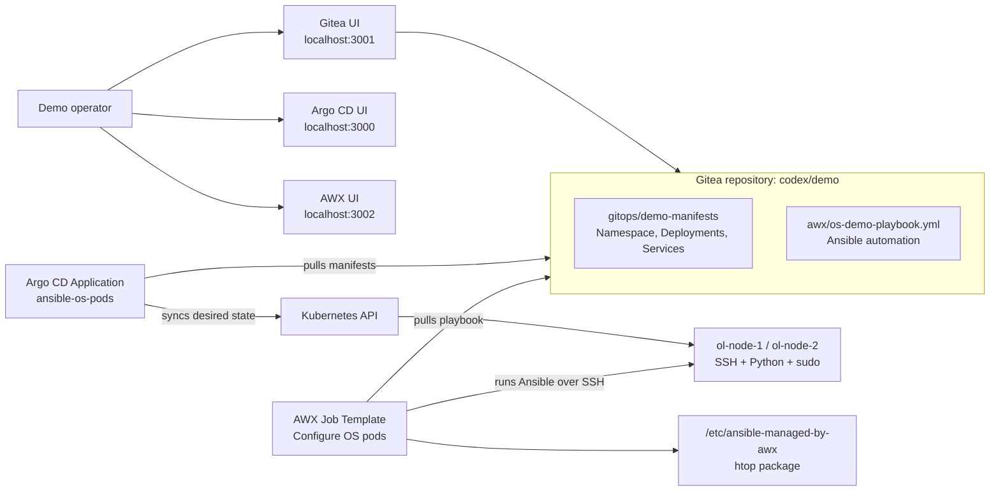
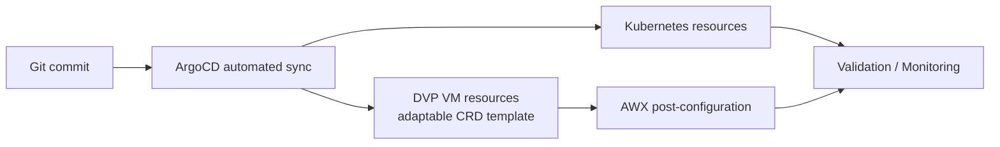

# Argo CD + AWX + Kubernetes + DVP demo

This project builds a local, repeatable demo stand that shows how GitOps and Ansible can work together in a Kubernetes-native environment.

The extended scenario set is designed for presale and architecture discussions. It shows how a Git change can drive application rollout, infrastructure reconciliation, DVP-style VM lifecycle changes, AWX post-configuration and validation.

The important boundary:

- Argo CD manages Kubernetes resources from Git.
- AWX/Ansible manages the OS/userspace inside the workloads that Argo CD created.

For a DVP/KubeVirt-style platform the same pattern maps cleanly to CRDs such as `VirtualMachine`, `VirtualDisk`, `VirtualImage`, `VirtualMachineClass` and Services. Argo CD still reconciles Kubernetes objects. Ansible still handles operational configuration inside the guest OS over SSH or another remote execution channel.

## Components

| Component | Namespace | Purpose |
| --- | --- | --- |
| Gitea | `gitea` | Local Git server used as the single source of truth for manifests and Ansible code. |
| Argo CD | `argocd` | Watches the Gitea repository and reconciles Kubernetes resources. |
| AWX | `awx` | Runs Ansible jobs against the Linux pods. |
| Demo OS pods | `demo-os` | Two SSH-enabled Linux pods managed by Argo CD and configured by AWX. |
| Demo platform | `demo-prod` | Extended GitOps scenario with app, RBAC, Ingress, monitoring placeholder and DVP VM template. |
| Tenant example | `customer-a` | Self-service tenant onboarding example. |

## Architecture



Extended presale flow:



## Repository layout

| Path | Description |
| --- | --- |
| `gitops/demo-manifests/` | Kubernetes desired state that Argo CD syncs. |
| `gitops/environments/prod/` | Extended prod demo with centralized values, app, RBAC, quotas and monitoring placeholder. |
| `gitops/environments/dev/`, `gitops/environments/test/` | Placeholders for future environment overlays. |
| `gitops/infrastructure/dvp/` | DVP VM reference template. The active minimal VM manifest is in `gitops/environments/prod/dvp-postgres-vm.yaml`. |
| `gitops/awx/` | AWX playbooks, PostSync hook example and safe dummy secret example. |
| `gitops/environments/prod/tenants/customer-a/` | Self-service tenant provisioning example. |
| `scenarios/` | Step-by-step demo scenarios. |
| `awx/os-demo-playbook.yml` | Playbook that configures the OS layer inside the demo pods. |
| `awx/ansible-inventory.ini` | Static inventory reference for manual runs or documentation. |
| `manifests/argocd/` | Argo CD install manifest and Application resource. |
| `manifests/gitea/` | Gitea deployment, PVC and services. |
| `manifests/awx/` | AWX custom resource and local projects PVC compatibility manifest. |
| `scripts/bootstrap.sh` | Full repeatable installation and configuration script. |
| `scripts/run-demo-job.sh` | Launches the AWX job and verifies marker files in the pods. |
| `scripts/port-forward.sh` | Reopens UI port-forwards. |
| `scripts/stop-port-forward.sh` | Stops UI port-forwards started by the scripts. |
| `scripts/destroy.sh` | Removes the demo namespaces and local port-forwards. |
| `docs/use-cases.md` | Use cases and demo script. |

## Russian documentation

- [README.ru.md](README.ru.md) - full Russian project description.
- [docs/use-cases.ru.md](docs/use-cases.ru.md) - use cases and demonstration scenario in Russian.
- [docs/demo-talk-track.ru.md](docs/demo-talk-track.ru.md) - short talk track for a live demo.
- [docs/operations.ru.md](docs/operations.ru.md) - operational runbook and troubleshooting notes.

## Requirements

- Docker Desktop Kubernetes or another Kubernetes cluster with a default StorageClass.
- `kubectl`
- `git`
- `curl`
- `jq`
- Network access to pull images from Docker Hub, Quay and the AWX operator repository.

The default local ports are:

- Argo CD: `3000`
- Gitea: `3001`
- AWX: `3002`

## Quick start

```bash
git clone https://github.com/kirka1206/ArgoAWXk8sDVPdemo.git
cd ArgoAWXk8sDVPdemo
./scripts/bootstrap.sh
```

The script prints UI URLs and generated passwords at the end.

Run the Ansible part of the demo:

```bash
./scripts/run-demo-job.sh
```

For DKP deployment through Ingress, run:

```bash
AWX_URL=http://awx-demo.d8.kir.lab ./scripts/run-demo-job.sh
```

## DKP deployment

For the `d8.kir.lab` DKP cluster, use:

```bash
./scripts/deploy-dkp.sh
```

The script expects kube-context `codex-api.d8.kir.lab` and creates DKP ingress resources:

- Gitea: `http://gitea-awx.d8.kir.lab`
- Argo CD: `http://argocd-awx.d8.kir.lab`
- AWX: `http://awx-demo.d8.kir.lab`

Make sure these names resolve to the DKP ingress address in DNS or `/etc/hosts`.

## Scenario catalog

| Scenario | Focus |
| --- | --- |
| [01. Initial Deploy](scenarios/01-initial-deploy.md) | First Git-driven rollout of namespace, RBAC, app, Ingress, VM template and monitoring placeholder. |
| [02. Scale Application](scenarios/02-scale-application.md) | Scaling `demo-app` from Git instead of `kubectl scale`. |
| [03. Drift Correction](scenarios/03-drift-correction.md) | ArgoCD self-healing after manual replica drift. |
| [04. VM Resize](scenarios/04-vm-resize.md) | CPU/RAM change through Git for an adaptable DVP VM manifest. |
| [05. AWX Post-Configuration](scenarios/05-awx-post-config.md) | AWX bootstrap, PostgreSQL tuning and validation after ArgoCD changes infrastructure. |
| [06. Broken Release And Rollback](scenarios/06-broken-release-and-rollback.md) | ImagePullBackOff and recovery through `git revert`. |
| [07. Self-Service Tenant](scenarios/07-self-service-tenant.md) | Tenant onboarding by adding a Git directory. |

## Extended GitOps objects

The extended Application example is:

```bash
kubectl apply -f manifests/argocd/application-demo-platform.yaml
```

It uses:

- automated sync;
- `prune: true`;
- `selfHeal: true`;
- retry limit `5`;
- sync waves for namespace/RBAC, infrastructure, app, monitoring and AWX hook.

The centralized demo values live in:

```text
gitops/environments/prod/values.yaml
```

The current manifests are plain Kubernetes YAML, so values are documented and mirrored in the demo manifests. If the repo is later converted to Helm or Kustomize replacements, this file should become the single input for generated manifests.

## What the bootstrap script does

1. Installs Argo CD.
2. Installs Gitea.
3. Creates a Gitea user and repository.
4. Pushes this project into Gitea.
5. Creates an Argo CD Application pointing to `gitops/demo-manifests`.
6. Waits for Argo CD to deploy `ol-node-1` and `ol-node-2`.
7. Installs the AWX operator and AWX.
8. Configures AWX inventory, group, hosts, machine credential, project, execution environment and job template.
9. Starts local port-forwards for all UIs.

## Validation commands

```bash
kubectl get application -n argocd ansible-os-pods
kubectl get pods -n gitea
kubectl get pods -n argocd
kubectl get pods -n awx
kubectl get pods -n demo-os
kubectl exec -n demo-os deploy/ol-node-1 -- cat /etc/ansible-managed-by-awx
kubectl exec -n demo-os deploy/ol-node-2 -- cat /etc/ansible-managed-by-awx
```

Extended scenario checks:

```bash
argocd app get demo-platform
kubectl get deploy,svc,ingress -n demo-prod
kubectl get resourcequota,limitrange -n demo-prod
kubectl get ns customer-a
```

Expected marker content:

```text
managed_by=AWX
deployed_by=Argo CD
host=ol-node-1.demo-os.svc.cluster.local
kernel=...
```

## Cleanup

```bash
./scripts/destroy.sh
```

For scenario-only changes, prefer Git rollback:

```bash
git revert HEAD
git push
argocd app get demo-platform
```

## Troubleshooting

### ArgoCD is OutOfSync

```bash
argocd app get demo-platform
kubectl describe application -n argocd demo-platform
```

Check whether the Git path exists and whether placeholder DVP manifests were accidentally included before adapting the CRD.

### Demo app is ImagePullBackOff

```bash
kubectl get pods -n demo-prod
kubectl describe pod -n demo-prod -l app=demo-app
```

This is expected in the broken release scenario. Revert the Git commit to recover.

### AWX hook cannot authenticate

Do not commit real tokens. Create a real Secret from `gitops/awx/secrets/awx-token.example.yaml` using your secure values:

```bash
kubectl create secret generic awx-api-token \
  -n demo-prod \
  --from-literal=url=https://awx.example.local \
  --from-literal=token=demo-token-replace-me
```

Replace the example URL and token before using it outside the demo.

## Notes for DVP/KubeVirt adaptation

This demo uses simple Linux pods because it runs on plain Docker Desktop Kubernetes. In a Deckhouse Virtualization Platform or KubeVirt environment, replace `gitops/demo-manifests/os-nodes.yaml` or adapt `gitops/infrastructure/dvp/postgres-vm.template.yaml` with the platform-native VM resources:

- `VirtualMachine`
- `VirtualDisk`
- `VirtualImage`
- `VirtualMachineClass`
- Services or publishing resources for SSH access

Keep the same split:

- desired VM/Kubernetes state lives in Git and is reconciled by Argo CD;
- guest OS configuration is executed by AWX/Ansible.

The DKP/DVP lab profile includes one minimal test VM manifest:

- `VirtualImage`: `demo-alpine-cloud`
- `VirtualDisk`: `postgres-vm-root`, `256Mi`
- `VirtualMachine`: `postgres-vm`, `1` core, `coreFraction: 5%`, `512Mi` RAM

This is intentionally small for demo clusters with limited resources.
