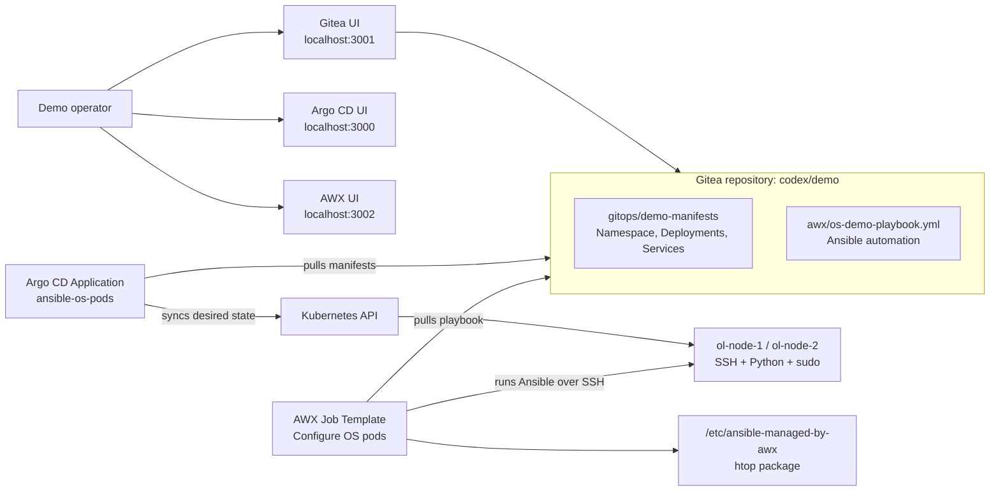

# Argo CD + AWX Kubernetes demo

This project builds a local, repeatable demo stand that shows how GitOps and Ansible can work together in a Kubernetes-native environment.

The important boundary:

- Argo CD manages Kubernetes resources from Git.
- AWX/Ansible manages the OS/userspace inside the workloads that Argo CD created.

For a DVP/KubeVirt-style platform the same pattern maps cleanly to CRDs such as `VirtualMachine`, `VirtualDisk`, `VirtualImage`, `VirtualMachineClass` and Services. Argo CD still reconciles Kubernetes objects. Ansible still handles operational configuration inside the guest OS over SSH or another remote execution channel.

## Components

| Component | Namespace | Purpose |
| --- | --- | --- |
| Gitea | `gitea` | Local Git server used as the single source of truth for manifests and Ansible code. |
| Argo CD | `argocd` | Watches the Gitea repository and reconciles Kubernetes resources. |
| AWX | `awx` | Runs Ansible jobs against the Linux pods. |
| Demo OS pods | `demo-os` | Two SSH-enabled Linux pods managed by Argo CD and configured by AWX. |

## Architecture



## Repository layout

| Path | Description |
| --- | --- |
| `gitops/demo-manifests/` | Kubernetes desired state that Argo CD syncs. |
| `awx/os-demo-playbook.yml` | Playbook that configures the OS layer inside the demo pods. |
| `awx/ansible-inventory.ini` | Static inventory reference for manual runs or documentation. |
| `manifests/argocd/` | Argo CD install manifest and Application resource. |
| `manifests/gitea/` | Gitea deployment, PVC and services. |
| `manifests/awx/` | AWX custom resource and local projects PVC compatibility manifest. |
| `scripts/bootstrap.sh` | Full repeatable installation and configuration script. |
| `scripts/run-demo-job.sh` | Launches the AWX job and verifies marker files in the pods. |
| `scripts/port-forward.sh` | Reopens UI port-forwards. |
| `scripts/stop-port-forward.sh` | Stops UI port-forwards started by the scripts. |
| `scripts/destroy.sh` | Removes the demo namespaces and local port-forwards. |
| `docs/use-cases.md` | Use cases and demo script. |

## Russian documentation

- [README.ru.md](README.ru.md) - full Russian project description.
- [docs/use-cases.ru.md](docs/use-cases.ru.md) - use cases and demonstration scenario in Russian.
- [docs/demo-talk-track.ru.md](docs/demo-talk-track.ru.md) - short talk track for a live demo.
- [docs/operations.ru.md](docs/operations.ru.md) - operational runbook and troubleshooting notes.

## Requirements

- Docker Desktop Kubernetes or another Kubernetes cluster with a default StorageClass.
- `kubectl`
- `git`
- `curl`
- `jq`
- Network access to pull images from Docker Hub, Quay and the AWX operator repository.

The default local ports are:

- Argo CD: `3000`
- Gitea: `3001`
- AWX: `3002`

## Quick start

```bash
git clone https://github.com/kirka1206/ArgoAWXk8sDVPdemo.git
cd ArgoAWXk8sDVPdemo
./scripts/bootstrap.sh
```

The script prints UI URLs and generated passwords at the end.

Run the Ansible part of the demo:

```bash
./scripts/run-demo-job.sh
```

## DKP deployment

For the `d8.kir.lab` DKP cluster, use:

```bash
./scripts/deploy-dkp.sh
```

The script expects kube-context `codex-api.d8.kir.lab` and creates DKP ingress resources:

- Gitea: `http://gitea-awx.d8.kir.lab`
- Argo CD: `http://argocd-awx.d8.kir.lab`
- AWX: `http://awx-demo.d8.kir.lab`

## What the bootstrap script does

1. Installs Argo CD.
2. Installs Gitea.
3. Creates a Gitea user and repository.
4. Pushes this project into Gitea.
5. Creates an Argo CD Application pointing to `gitops/demo-manifests`.
6. Waits for Argo CD to deploy `ol-node-1` and `ol-node-2`.
7. Installs the AWX operator and AWX.
8. Configures AWX inventory, group, hosts, machine credential, project, execution environment and job template.
9. Starts local port-forwards for all UIs.

## Validation commands

```bash
kubectl get application -n argocd ansible-os-pods
kubectl get pods -n gitea
kubectl get pods -n argocd
kubectl get pods -n awx
kubectl get pods -n demo-os
kubectl exec -n demo-os deploy/ol-node-1 -- cat /etc/ansible-managed-by-awx
kubectl exec -n demo-os deploy/ol-node-2 -- cat /etc/ansible-managed-by-awx
```

Expected marker content:

```text
managed_by=AWX
deployed_by=Argo CD
host=ol-node-1.demo-os.svc.cluster.local
kernel=...
```

## Cleanup

```bash
./scripts/destroy.sh
```

## Notes for DVP/KubeVirt adaptation

This demo uses simple Linux pods because it runs on plain Docker Desktop Kubernetes. In a Deckhouse Virtualization Platform or KubeVirt environment, replace `gitops/demo-manifests/os-nodes.yaml` with the platform-native VM resources:

- `VirtualMachine`
- `VirtualDisk`
- `VirtualImage`
- `VirtualMachineClass`
- Services or publishing resources for SSH access

Keep the same split:

- desired VM/Kubernetes state lives in Git and is reconciled by Argo CD;
- guest OS configuration is executed by AWX/Ansible.
