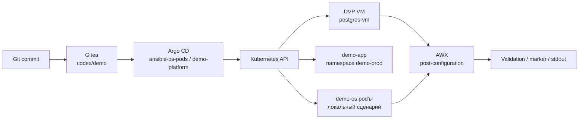
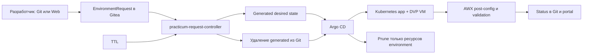

# Демо-стенд Argo CD + AWX + Kubernetes + DVP

Проект показывает, как GitOps и Ansible/AWX дополняют друг друга в Kubernetes-native платформе и в Deckhouse Virtualization Platform.

Ключевая граница:

- Argo CD управляет Kubernetes/DVP-ресурсами из Git.
- AWX/Ansible выполняет настройку внутри ОС уже созданных workload'ов или виртуальных машин.

В локальном Docker Desktop Kubernetes для простого запуска используются два Linux pod'а с SSH. В DKP/DVP-кластере дополнительно разворачивается настоящий минимальный DVP-контур: приложение, tenant и тестовая VM `postgres-vm`.

## Что демонстрирует стенд

1. Git является source of truth для манифестов, сценариев и Ansible-кода.
2. Argo CD применяет desired state без ручного `kubectl apply`.
3. DVP VM создаётся декларативно через CRD `virtualization.deckhouse.io`.
4. AWX запускает Ansible job и показывает, зачем нужен procedural слой после GitOps.
5. Drift, rollback, scale и tenant onboarding показываются как изменения в Git.

## Компоненты

| Компонент | Namespace | Роль |
| --- | --- | --- |
| Gitea | `gitea` | Git-сервер стенда, источник манифестов и playbook'ов. |
| Argo CD | `argocd` | Синхронизирует desired state из Git. |
| AWX | `awx` | Запускает Ansible job'ы для настройки ОС/userspace. |
| Demo OS pods | `demo-os` | Локальный pod-only сценарий для Docker Desktop. |
| Demo platform | `demo-prod` | Расширенный DKP/DVP сценарий: приложение, RBAC, Ingress, заготовка monitoring-объектов, DVP VM. |
| Tenant example | `customer-a` | Пример self-service onboarding tenant'а. |

## Архитектура



## Структура репозитория

| Путь | Назначение |
| --- | --- |
| `gitops/demo-manifests/` | Локальный pod-only desired state для Application `ansible-os-pods`. |
| `gitops/environments/prod/` | Расширенный prod-контур для Application `demo-platform`. |
| `gitops/environments/prod/values.yaml` | Централизованные demo-параметры окружения. |
| `gitops/environments/prod/dvp-postgres-vm.yaml` | Реальный минимальный DVP manifest для `postgres-vm`. |
| `gitops/environments/prod/golden-images/` | Сценарий импорта исходного образа из URL, builder VM и публикации golden image. |
| `gitops/environments/prod/tenants/customer-a/` | Пример self-service tenant. |
| `gitops/self-service/` | Catalog, request и generated manifests для controlled self-service стендов. |
| `gitops/self-service/portal/` | Self-service portal с DexAuthenticator, backend и GitOps submit flow. |
| `self-service-ui/` | Одностраничный web UI для генерации GitOps self-service request. |
| `gitops/awx/` | AWX playbooks, PostSync hook и пример Secret без реальных токенов. |
| `gitops/infrastructure/dvp/` | Reference template для DVP VM. |
| `scenarios/` | Подробные демонстрационные сценарии. |
| `awx/os-demo-playbook.yml` | Playbook для pod-only сценария `demo-os`. |
| `manifests/argocd/` | Argo CD Application manifests. |
| `manifests/dkp/` | Ingress'ы для DKP-кластера. |
| `scripts/` | Bootstrap, deploy, port-forward, run-demo-job, cleanup. |
| `docs/` | Русские use cases, runbook, talk track, пререквизиты и план переноса. |

## Правило ведения контекста

Для этого репозитория архитектурные решения фиксируются в `README.md` и `README.ru.md`. Оперативный статус хранится в `docs/STATUS.md`, а ближайшие планы и открытые решения - в `docs/NEXT_STEPS.md`.

Перед началом новой работы в репозитории сначала прочитайте:

```text
docs/STATUS.md
docs/NEXT_STEPS.md
```

После значимых изменений обновляйте `docs/STATUS.md`. Если меняется архитектурная договорённость, обновляйте обе версии README.

Текущая стабильная точка и приоритетный backlog:

- [текущее состояние](docs/STATUS.md);
- [следующие шаги](docs/NEXT_STEPS.md).

На checkpoint от 9 июня 2026 года временные self-service окружения очищены по
TTL, Argo CD находится в `Synced/Healthy`, golden image v2 активен, обе builder
VM остановлены. Это безопасная точка для следующего этапа.

## Требования

- `kubectl`
- `git`
- `curl`
- `jq`
- Kubernetes-кластер с default StorageClass
- Для DVP-сценария: DKP/DVP с CRD `virtualization.deckhouse.io`

Для локального сценария достаточно Docker Desktop Kubernetes. Для DKP/DVP сценария нужны IngressClass, StorageClass, DVP, Dex/OIDC и доступ к внешним образам или их внутренние зеркала.

Подробный список требований к новому стенду: [docs/prerequisites.ru.md](docs/prerequisites.ru.md).

Детальный план переноса на другой DKP/DVP стенд: [docs/migration-plan.ru.md](docs/migration-plan.ru.md).

## Быстрый локальный запуск

```bash
git clone https://github.com/kirka1206/ArgoAWXk8sDVPdemo.git
cd ArgoAWXk8sDVPdemo
./scripts/bootstrap.sh
```

Скрипт поднимает Gitea, Argo CD, AWX, Application `ansible-os-pods` и два Linux pod'а.

Запуск AWX job:

```bash
./scripts/run-demo-job.sh
```

## Запуск в DKP/DVP

```bash
./scripts/deploy-dkp.sh
```

По умолчанию скрипт настроен на текущий demo-стенд `d8.kir.lab`. Для другого стенда передайте параметры окружения:

```bash
CONTEXT=<target-context> \
GITEA_HOST=gitea-awx.<target-domain> \
ARGOCD_HOST=argocd-awx.<target-domain> \
AWX_HOST=awx-demo.<target-domain> \
./scripts/deploy-dkp.sh
```

На текущем стенде используются Ingress'ы:

- Gitea: `http://gitea-awx.d8.kir.lab`
- Argo CD: `http://argocd-awx.d8.kir.lab`
- AWX: `http://awx-demo.d8.kir.lab`

Для запуска AWX job в DKP используйте Ingress, а не случайный старый port-forward:

```bash
AWX_URL=http://awx-demo.d8.kir.lab ./scripts/run-demo-job.sh
```

## Установка платформенных компонентов в проект `practicum-tks`

Для нового DKP/DVP-стенда подготовлен отдельный namespace-scoped комплект:

```bash
EXPECTED_CONTEXT=practicum-tks-api.d8case.ru \
NAMESPACE=practicum-tks \
./scripts/install-practicum-platform.sh
```

Скрипт устанавливает в namespace `practicum-tks`:

- Gitea `1.24.6`, аккаунт `practicum`, репозиторий `practicum/practicum-demo`;
- Argo CD `3.4.2`, локальный аккаунт `practicum-admin`;
- AWX Operator `2.19.1` и AWX `24.6.1`, аккаунт `practicum-admin`;
- Ingress-объекты и минимальные default resources для служебных pod сторонних операторов.

Архитектурное решение: рабочие компоненты и их RBAC размещаются в проекте
`practicum-tks`. Cluster-scoped CRD Argo CD и AWX создаются отдельно, потому что
Kubernetes не поддерживает namespace-scoped CRD. Argo CD получает Role только
на управление ресурсами namespace `practicum-tks`, а не всего кластера.

Адреса:

- Gitea: `http://gitea-practicum.d8case.ru`
- Argo CD: `http://argocd-practicum.d8case.ru`
- AWX: `http://awx-practicum.d8case.ru`
- Self-service: `https://selfservice-practicum.d8case.ru`

Ingress IP на момент установки: `192.168.2.31`. Пока DNS-записи не созданы,
на рабочей станции нужны записи:

```text
192.168.2.31 gitea-practicum.d8case.ru
192.168.2.31 argocd-practicum.d8case.ru
192.168.2.31 awx-practicum.d8case.ru
192.168.2.31 selfservice-practicum.d8case.ru
```

Пароли не хранятся в Git. Получить созданные credentials можно так:

```bash
kubectl -n practicum-tks get secret practicum-gitea-admin-credentials
kubectl -n practicum-tks get secret practicum-argocd-admin-credentials
kubectl -n practicum-tks get secret practicum-awx-admin-password
```

Манифесты находятся в `manifests/practicum/`. Установка идемпотентна и не
удаляет уже существующие на стенде объекты.

### Актуальный контур `practicum-tks`



Argo CD Application `practicum-demo` читает
`gitops/environments/practicum`. Все workload-объекты создаются только в
namespace `practicum-tks`. Controller не выполняет `kubectl delete`: при
истечении TTL он архивирует request и удаляет generated-каталог из Git, после
чего Argo CD prune удаляет ресурсы с labels конкретного environment.

Ограничения self-service:

- максимум три активных окружения;
- максимум две одновременно работающие VM;
- пользователь выбирает только утверждённый профиль и TTL;
- VM используют `VirtualImage`, указанный в `activeGoldenImage`;
- AWX запускается после готовности guest OS и выполняет не более трёх попыток.

Golden image pipeline хранится в
`gitops/environments/practicum/golden-images`. Git задаёт source URL, builder,
versioned images и active-указатель. Проверены `practicum-alpine-golden-3-23-v1`
и `practicum-alpine-golden-3-23-v2`; active версия — v2. Старые версии не
изменяются и доступны для rollback.

## Расширенный DVP-контур

Application `demo-platform` синхронизирует путь:

```text
gitops/environments/prod
```

Создать Application:

```bash
kubectl apply -f manifests/argocd/application-demo-platform.yaml
```

Проверить:

```bash
kubectl get application -n argocd demo-platform
kubectl get deploy,svc,ingress -n demo-prod
kubectl get vi,vd,vm -n demo-prod -o wide
kubectl get ns customer-a
```

Ожидаемое состояние DVP VM:

```text
VirtualImage demo-alpine-cloud: Ready
VirtualDisk postgres-vm-root: Ready, 256Mi
VirtualMachine postgres-vm: Running
CPU: 1 core, coreFraction 5%
RAM: 512Mi
```

VM специально минимальная, чтобы стенд не потреблял лишние ресурсы.

## Сценарии

| Сценарий | Что показывает |
| --- | --- |
| [01. Initial Deploy](scenarios/01-initial-deploy.md) | Первичное развёртывание из Git. |
| [02. Scale Application](scenarios/02-scale-application.md) | Scale через Git, а не `kubectl scale`. |
| [03. Drift Correction](scenarios/03-drift-correction.md) | Self-healing после ручного drift. |
| [04. VM Resize](scenarios/04-vm-resize.md) | Изменение параметров DVP VM через Git. |
| [05. AWX Post-Configuration](scenarios/05-awx-post-config.md) | Post-config ОС/БД через AWX. |
| [06. Broken Release And Rollback](scenarios/06-broken-release-and-rollback.md) | Ошибка image tag и rollback через Git. |
| [07. Self-Service Tenant](scenarios/07-self-service-tenant.md) | Tenant onboarding через каталог в Git. |
| [08. Golden Image Management](scenarios/08-golden-image-management.md) | Импорт исходного image из URL, builder VM, AWX customization и публикация golden image. |
| [09. Self-Service Environment Request](scenarios/09-self-service-environment-request.md) | Разработчик выбирает профиль стенда через Git/request или web UI, Argo CD и AWX создают окружение. |
| [10. Self-Service Portal](scenarios/10-self-service-portal.md) | Разработчик логинится через Dex, выбирает профиль и создаёт стенд через web portal. |
| [11. Practicum End-to-End](scenarios/11-practicum-end-to-end.md) | Актуальный сценарий нового стенда: golden image, Git/Web request, AWX и TTL cleanup. |
| [12. DVP VM Drift Correction](scenarios/12-dvp-vm-drift-correction.md) | Ручное изменение CPU/RAM DVP VM, Argo CD self-heal и безопасная модель RBAC. |

## Self-service UI

Для демонстрации developer-facing UX есть статическое web-приложение:

```bash
open self-service-ui/index.html
```

UI не создаёт ресурсы напрямую. Он генерирует `EnvironmentRequest` YAML и Git-команды. Дальше request проходит через Git, review/merge, Argo CD sync и AWX post-configuration.

Для DVP VM self-service использует утверждённые `ClusterVirtualImage`, чтобы tenant namespace мог создавать диски из общего платформенного каталога образов без копирования namespaced `VirtualImage`.

GitOps/YAML-вариант описан в [docs/self-service.ru.md](docs/self-service.ru.md) и [scenarios/09-self-service-environment-request.md](scenarios/09-self-service-environment-request.md): разработчик создаёт `EnvironmentRequest` в `gitops/self-service/requests/`, а automation/controller должен сгенерировать manifests в `gitops/self-service/generated/`.

## Self-service portal в кластере

Актуальный portal нового стенда размещён в `practicum-tks` и доступен по адресу:

```text
https://selfservice-practicum.d8case.ru
```

Доступ закрыт через DKP `DexAuthenticator`. Portal создаёт только
`EnvironmentRequest`; generated manifests создаёт отдельный controller. Portal
показывает environment ID, фиксированный namespace `practicum-tks`, Git commit,
Argo CD, приложение, DVP VM, фактический golden image, AWX job и TTL.
Кнопка `Выйти` вызывает endpoint `/logout`, созданный `DexAuthenticator`, и
завершает Dex-сессию перед входом под другим демонстрационным пользователем.
Portal определяет канонического владельца по проверенному Dex e-mail и
пересечению с разрешённой группой. Техническое значение
`X-Auth-Request-User` не используется в имени EnvironmentRequest.
Repository webhook Gitea отправляет push events на внутренний endpoint
`argocd-server.practicum-tks.svc.cluster.local/api/webhook`. В allowlist Gitea
разрешён только этот host, поэтому Argo CD обновляет Application сразу после
commit, не ожидая периодического Git polling. Application и webhook используют
одинаковый canonical repo URL `http://gitea-practicum.d8case.ru/...`;
`argocd-repo-server` разрешает это имя локально через точечный host alias на
ingress IP `192.168.2.31`.

UI подробно объясняет профиль стенда, purpose, квоты и состав ресурсов. После создания заявки он показывает namespace, профиль, TTL, параметры приложения, service/ingress, VM/disk параметры и пути GitOps artifacts.
После отправки UI показывает понятный пользовательский статус `В работе`,
`В очереди`, `Готово` или `Ошибка`. Пока заявка обрабатывается, portal каждые
5 секунд обновляет текущий этап: Git/controller, Argo CD, Kubernetes, DVP,
готовность гостевой ОС или AWX post-configuration.
После трёх неуспешных AWX attempts заявка переходит в terminal state `Error` и
показывает номер последнего job. Для Alpine playbook выбирает доступный
versioned пакет PostgreSQL из репозитория образа вместо жёсткой привязки к
одной версии.

Для профиля `app-with-postgres-vm` пользователь выбирает PostgreSQL `16`, `17`
или `18`. Версия сохраняется в `EnvironmentRequest`, валидируется controller и
передаётся в AWX как конкретный пакет `postgresqlNN`. Для любого VM-профиля
portal показывает логин `ansible`, key-based способ аутентификации и готовую
команду `d8 v ssh` с именем VM, namespace и локальным путём к ключу. Приватный
ключ и пароль в Git/status не публикуются.

Ёмкость self-service задаётся переменными окружения request controller:
`MAX_ACTIVE_ENVIRONMENTS=7` и `MAX_ACTIVE_VMS=7`. При достижении одного из
лимитов корректная заявка получает `Queued/capacity-limit` и автоматически
продолжается после освобождения места.

Lifecycle-операции также проходят через GitOps. Пользователь управляет своими
стендами в разделах `Мои стенды` и `История`, а Victor использует отдельный
портал `https://vm-admin-practicum.d8case.ru`. Порталы создают
`EnvironmentAction` в Git; request controller атомарно обновляет desired state,
а Argo CD выполняет sync/prune. Прямой `kubectl delete` не используется.

Поддерживаются `delete-environment`, `delete-vm`, `start-vm`, `stop-vm` и
`restart-vm`. Обычный пользователь может удалить только собственный стенд или
VM с диском. Victor видит все tenant environments, обязан указать причину и не
получает через портал доступ к golden builders или platform resources.

Для локального DNS добавьте:

```text
192.168.2.31 selfservice-practicum.d8case.ru
```

Подробности: [docs/self-service-portal.ru.md](docs/self-service-portal.ru.md).

## Что делает bootstrap

1. Устанавливает Argo CD.
2. Устанавливает Gitea.
3. Создаёт пользователя и репозиторий в Gitea.
4. Загружает проект в Gitea.
5. Создаёт Application `ansible-os-pods`.
6. Ждёт pod'ы `ol-node-1` и `ol-node-2`.
7. Устанавливает AWX operator и AWX.
8. Создаёт AWX inventory, hosts, credential, project, execution environment и job template.
9. Поднимает локальные port-forward'ы для UI.

## Проверка pod-only сценария

```bash
kubectl get application -n argocd ansible-os-pods
kubectl get pods -n demo-os
kubectl exec -n demo-os deploy/ol-node-1 -- cat /etc/ansible-managed-by-awx
kubectl exec -n demo-os deploy/ol-node-2 -- cat /etc/ansible-managed-by-awx
```

Ожидаемый marker:

```text
managed_by=AWX
deployed_by=Argo CD
host=...
kernel=...
```

## Troubleshooting

### `run-demo-job.sh` возвращает 401

Частая причина: `localhost:3002` смотрит на старый AWX из другого kube-context. В DKP запускайте так:

```bash
AWX_URL=http://awx-demo.d8.kir.lab ./scripts/run-demo-job.sh
```

### `demo-platform` OutOfSync

```bash
kubectl describe application -n argocd demo-platform
kubectl get events -n demo-prod --sort-by=.lastTimestamp
```

Если в ошибке есть `data source cannot be changed if the VirtualDisk has already been provisioned`, Argo CD пытается изменить immutable-источник уже подготовленного DVP `VirtualDisk`. Для `demo-prod/postgres-vm-root` в Application `demo-platform` специально настроен ignore `/spec/dataSource` и `/spec/persistentVolumeClaim` вместе с `RespectIgnoreDifferences=true`. Если нужно сменить базовый образ уже созданной VM, используйте новый диск или controlled restore/recreate flow, а не patch `dataSource` на существующем диске.

Если ошибка связана с `gitops/self-service/generated/kustomization.yaml`, проверьте, что файл содержит либо:

```yaml
resources: []
```

либо многострочный список:

```yaml
resources:
  - dev-example
```

### DVP disk долго в `Provisioning`

Проверить disk и events:

```bash
kubectl describe vd postgres-vm-root -n demo-prod
kubectl get events -n demo-prod --sort-by=.lastTimestamp
```

Для первого запуска нормально, что image скачивается, а disk импортируется несколько минут.

### AWX долго стартует

```bash
kubectl get job,pods -n awx
kubectl logs -n awx job/awx-demo-migration-24.6.1 --tail=100
```

## Rollback и очистка

Сценарные изменения откатывайте через Git:

```bash
git revert HEAD
git push
argocd app get demo-platform
```

Удаление локального стенда:

```bash
./scripts/destroy.sh
```

Для DVP-ресурсов дополнительно проверьте, что удаление VM/disk допустимо для текущего стенда:

```bash
kubectl get vi,vd,vm -n demo-prod
```
