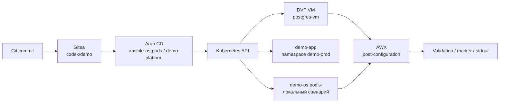

# Демо-стенд Argo CD + AWX + Kubernetes + DVP

Проект показывает, как GitOps и Ansible/AWX дополняют друг друга в Kubernetes-native платформе и в Deckhouse Virtualization Platform.

Ключевая граница:

- Argo CD управляет Kubernetes/DVP-ресурсами из Git.
- AWX/Ansible выполняет настройку внутри ОС уже созданных workload'ов или виртуальных машин.

В локальном Docker Desktop Kubernetes для простого запуска используются два Linux pod'а с SSH. В DKP/DVP-кластере дополнительно разворачивается настоящий минимальный DVP-контур: приложение, tenant и тестовая VM `postgres-vm`.

## Что демонстрирует стенд

1. Git является source of truth для манифестов, сценариев и Ansible-кода.
2. Argo CD применяет desired state без ручного `kubectl apply`.
3. DVP VM создаётся декларативно через CRD `virtualization.deckhouse.io`.
4. AWX запускает Ansible job и показывает, зачем нужен procedural слой после GitOps.
5. Drift, rollback, scale и tenant onboarding показываются как изменения в Git.

## Компоненты

| Компонент | Namespace | Роль |
| --- | --- | --- |
| Gitea | `gitea` | Git-сервер стенда, источник манифестов и playbook'ов. |
| Argo CD | `argocd` | Синхронизирует desired state из Git. |
| AWX | `awx` | Запускает Ansible job'ы для настройки ОС/userspace. |
| Demo OS pods | `demo-os` | Локальный pod-only сценарий для Docker Desktop. |
| Demo platform | `demo-prod` | Расширенный DKP/DVP сценарий: приложение, RBAC, Ingress, заготовка monitoring-объектов, DVP VM. |
| Tenant example | `customer-a` | Пример self-service onboarding tenant'а. |

## Архитектура



## Структура репозитория

| Путь | Назначение |
| --- | --- |
| `gitops/demo-manifests/` | Локальный pod-only desired state для Application `ansible-os-pods`. |
| `gitops/environments/prod/` | Расширенный prod-контур для Application `demo-platform`. |
| `gitops/environments/prod/values.yaml` | Централизованные demo-параметры окружения. |
| `gitops/environments/prod/dvp-postgres-vm.yaml` | Реальный минимальный DVP manifest для `postgres-vm`. |
| `gitops/environments/prod/golden-images/` | Сценарий импорта исходного образа из URL, builder VM и публикации golden image. |
| `gitops/environments/prod/tenants/customer-a/` | Пример self-service tenant. |
| `gitops/self-service/` | Catalog, request и generated manifests для controlled self-service стендов. |
| `gitops/self-service/portal/` | Self-service portal с DexAuthenticator, backend и GitOps submit flow. |
| `self-service-ui/` | Одностраничный web UI для генерации GitOps self-service request. |
| `gitops/awx/` | AWX playbooks, PostSync hook и пример Secret без реальных токенов. |
| `gitops/infrastructure/dvp/` | Reference template для DVP VM. |
| `scenarios/` | Подробные демонстрационные сценарии. |
| `awx/os-demo-playbook.yml` | Playbook для pod-only сценария `demo-os`. |
| `manifests/argocd/` | Argo CD Application manifests. |
| `manifests/dkp/` | Ingress'ы для DKP-кластера. |
| `scripts/` | Bootstrap, deploy, port-forward, run-demo-job, cleanup. |
| `docs/` | Русские use cases, runbook и talk track. |

## Правило ведения контекста

Для этого репозитория архитектурные решения фиксируются в `README.md` и `README.ru.md`. Оперативный статус хранится в `docs/STATUS.md`, а ближайшие планы и открытые решения - в `docs/NEXT_STEPS.md`.

Перед началом новой работы в репозитории сначала прочитайте:

```text
docs/STATUS.md
docs/NEXT_STEPS.md
```

После значимых изменений обновляйте `docs/STATUS.md`. Если меняется архитектурная договорённость, обновляйте обе версии README.

## Требования

- `kubectl`
- `git`
- `curl`
- `jq`
- Kubernetes-кластер с default StorageClass
- Для DVP-сценария: DKP/DVP с CRD `virtualization.deckhouse.io`

Для локального сценария достаточно Docker Desktop Kubernetes. Для DVP-сценария используется кластер `d8.kir.lab`.

## Быстрый локальный запуск

```bash
git clone https://github.com/kirka1206/ArgoAWXk8sDVPdemo.git
cd ArgoAWXk8sDVPdemo
./scripts/bootstrap.sh
```

Скрипт поднимает Gitea, Argo CD, AWX, Application `ansible-os-pods` и два Linux pod'а.

Запуск AWX job:

```bash
./scripts/run-demo-job.sh
```

## Запуск в DKP/DVP d8.kir.lab

```bash
./scripts/deploy-dkp.sh
```

Скрипт ожидает kube-context `codex-api.d8.kir.lab` и создаёт Ingress'ы:

- Gitea: `http://gitea-awx.d8.kir.lab`
- Argo CD: `http://argocd-awx.d8.kir.lab`
- AWX: `http://awx-demo.d8.kir.lab`

Для запуска AWX job в DKP используйте Ingress, а не случайный старый port-forward:

```bash
AWX_URL=http://awx-demo.d8.kir.lab ./scripts/run-demo-job.sh
```

## Расширенный DVP-контур

Application `demo-platform` синхронизирует путь:

```text
gitops/environments/prod
```

Создать Application:

```bash
kubectl apply -f manifests/argocd/application-demo-platform.yaml
```

Проверить:

```bash
kubectl get application -n argocd demo-platform
kubectl get deploy,svc,ingress -n demo-prod
kubectl get vi,vd,vm -n demo-prod -o wide
kubectl get ns customer-a
```

Ожидаемое состояние DVP VM:

```text
VirtualImage demo-alpine-cloud: Ready
VirtualDisk postgres-vm-root: Ready, 256Mi
VirtualMachine postgres-vm: Running
CPU: 1 core, coreFraction 5%
RAM: 512Mi
```

VM специально минимальная, чтобы стенд не потреблял лишние ресурсы.

## Сценарии

| Сценарий | Что показывает |
| --- | --- |
| [01. Initial Deploy](scenarios/01-initial-deploy.md) | Первичное развёртывание из Git. |
| [02. Scale Application](scenarios/02-scale-application.md) | Scale через Git, а не `kubectl scale`. |
| [03. Drift Correction](scenarios/03-drift-correction.md) | Self-healing после ручного drift. |
| [04. VM Resize](scenarios/04-vm-resize.md) | Изменение параметров DVP VM через Git. |
| [05. AWX Post-Configuration](scenarios/05-awx-post-config.md) | Post-config ОС/БД через AWX. |
| [06. Broken Release And Rollback](scenarios/06-broken-release-and-rollback.md) | Ошибка image tag и rollback через Git. |
| [07. Self-Service Tenant](scenarios/07-self-service-tenant.md) | Tenant onboarding через каталог в Git. |
| [08. Golden Image Management](scenarios/08-golden-image-management.md) | Импорт исходного image из URL, builder VM, AWX customization и публикация golden image. |
| [09. Self-Service Environment Request](scenarios/09-self-service-environment-request.md) | Разработчик выбирает профиль стенда через Git/request или web UI, Argo CD и AWX создают окружение. |
| [10. Self-Service Portal](scenarios/10-self-service-portal.md) | Разработчик логинится через Dex, выбирает профиль и создаёт стенд через web portal. |

## Self-service UI

Для демонстрации developer-facing UX есть статическое web-приложение:

```bash
open self-service-ui/index.html
```

UI не создаёт ресурсы напрямую. Он генерирует `EnvironmentRequest` YAML и Git-команды. Дальше request проходит через Git, review/merge, Argo CD sync и AWX post-configuration.

Для DVP VM self-service использует утверждённые `ClusterVirtualImage`, чтобы tenant namespace мог создавать диски из общего платформенного каталога образов без копирования namespaced `VirtualImage`.

GitOps/YAML-вариант описан в [docs/self-service.ru.md](docs/self-service.ru.md) и [scenarios/09-self-service-environment-request.md](scenarios/09-self-service-environment-request.md): разработчик создаёт `EnvironmentRequest` в `gitops/self-service/requests/`, а automation/controller должен сгенерировать manifests в `gitops/self-service/generated/`.

## Self-service portal в кластере

Portal размещается в DKP-кластере и доступен по адресу:

```text
https://selfservice-awx.d8.kir.lab
```

Доступ закрыт через DKP `DexAuthenticator`. Пользователь логинится через Dex, выбирает разрешённый профиль стенда, нажимает `Создать стенд`, после чего backend создаёт GitOps request и generated manifests в Gitea. Argo CD применяет изменения, а portal показывает статус namespace, приложения, ingress и DVP VM.

UI подробно объясняет профиль стенда, purpose, квоты и состав ресурсов. После создания заявки он показывает namespace, профиль, TTL, параметры приложения, service/ingress, VM/disk параметры и пути GitOps artifacts.

Для локального DNS добавьте:

```text
10.77.77.208 selfservice-awx.d8.kir.lab
```

Подробности: [docs/self-service-portal.ru.md](docs/self-service-portal.ru.md).

## Что делает bootstrap

1. Устанавливает Argo CD.
2. Устанавливает Gitea.
3. Создаёт пользователя и репозиторий в Gitea.
4. Загружает проект в Gitea.
5. Создаёт Application `ansible-os-pods`.
6. Ждёт pod'ы `ol-node-1` и `ol-node-2`.
7. Устанавливает AWX operator и AWX.
8. Создаёт AWX inventory, hosts, credential, project, execution environment и job template.
9. Поднимает локальные port-forward'ы для UI.

## Проверка pod-only сценария

```bash
kubectl get application -n argocd ansible-os-pods
kubectl get pods -n demo-os
kubectl exec -n demo-os deploy/ol-node-1 -- cat /etc/ansible-managed-by-awx
kubectl exec -n demo-os deploy/ol-node-2 -- cat /etc/ansible-managed-by-awx
```

Ожидаемый marker:

```text
managed_by=AWX
deployed_by=Argo CD
host=...
kernel=...
```

## Troubleshooting

### `run-demo-job.sh` возвращает 401

Частая причина: `localhost:3002` смотрит на старый AWX из другого kube-context. В DKP запускайте так:

```bash
AWX_URL=http://awx-demo.d8.kir.lab ./scripts/run-demo-job.sh
```

### `demo-platform` OutOfSync

```bash
kubectl describe application -n argocd demo-platform
kubectl get events -n demo-prod --sort-by=.lastTimestamp
```

### DVP disk долго в `Provisioning`

Проверить disk и events:

```bash
kubectl describe vd postgres-vm-root -n demo-prod
kubectl get events -n demo-prod --sort-by=.lastTimestamp
```

Для первого запуска нормально, что image скачивается, а disk импортируется несколько минут.

### AWX долго стартует

```bash
kubectl get job,pods -n awx
kubectl logs -n awx job/awx-demo-migration-24.6.1 --tail=100
```

## Rollback и очистка

Сценарные изменения откатывайте через Git:

```bash
git revert HEAD
git push
argocd app get demo-platform
```

Удаление локального стенда:

```bash
./scripts/destroy.sh
```

Для DVP-ресурсов дополнительно проверьте, что удаление VM/disk допустимо для текущего стенда:

```bash
kubectl get vi,vd,vm -n demo-prod
```
