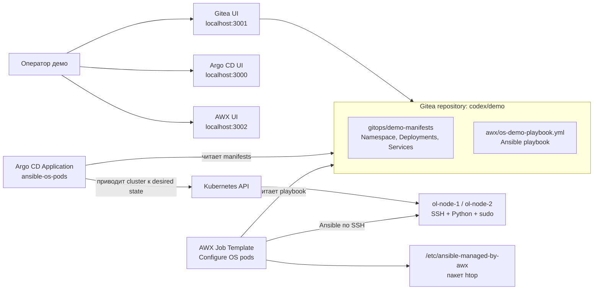

# Демо-стенд Argo CD + AWX для Kubernetes/DVP

Проект поднимает локальный воспроизводимый стенд, который показывает совместную работу GitOps и Ansible в Kubernetes-native среде.

Ключевая идея:

- Argo CD управляет Kubernetes-ресурсами из Git.
- AWX/Ansible управляет ОС или userspace внутри уже созданных workload'ов.

В локальном Docker Desktop Kubernetes вместо виртуальных машин используются два Linux pod'а с SSH, Python и sudo. Это сделано для простого запуска на ноутбуке. В Deckhouse Virtualization Platform или KubeVirt та же логика переносится на CRD уровня виртуализации: `VirtualMachine`, `VirtualDisk`, `VirtualImage`, `VirtualMachineClass` и сервисы публикации доступа.

## Что демонстрирует стенд

1. Gitea выступает локальным Git-сервером и хранит оба типа артефактов:
   - декларативное состояние Kubernetes;
   - Ansible playbook для настройки ОС.
2. Argo CD читает манифесты из Gitea и создает ресурсы в Kubernetes.
3. AWX читает playbook из того же репозитория и выполняет настройку внутри Linux pod'ов по SSH.
4. Результат виден в трех плоскостях:
   - Git: что должно быть развернуто и какой playbook должен выполняться;
   - Argo CD: что синхронизировано в Kubernetes;
   - AWX: какой job выполнился, на каких host'ах и с каким результатом.

## Компоненты

| Компонент | Namespace | Роль |
| --- | --- | --- |
| Gitea | `gitea` | Локальный Git-сервер и единый источник артефактов. |
| Argo CD | `argocd` | Синхронизирует Kubernetes-манифесты из Git. |
| AWX | `awx` | Запускает Ansible job'ы против Linux pod'ов. |
| Demo OS pods | `demo-os` | Два SSH-enabled Linux pod'а, которыми управляют Argo CD и AWX. |

## Архитектура



## Структура репозитория

| Путь | Назначение |
| --- | --- |
| `gitops/demo-manifests/` | Desired state, который синхронизирует Argo CD. |
| `awx/os-demo-playbook.yml` | Ansible playbook для настройки ОС внутри pod'ов. |
| `awx/ansible-inventory.ini` | Статический inventory для ручной проверки и документации. |
| `manifests/argocd/` | Установка Argo CD и Application для demo workload. |
| `manifests/gitea/` | Deployment, PVC и Services для Gitea. |
| `manifests/awx/` | AWX Custom Resource и PVC для локального сценария. |
| `scripts/bootstrap.sh` | Полный воспроизводимый запуск стенда. |
| `scripts/run-demo-job.sh` | Запуск AWX job и проверка результата в pod'ах. |
| `scripts/port-forward.sh` | Повторное открытие локальных UI-портов. |
| `scripts/stop-port-forward.sh` | Остановка port-forward процессов. |
| `scripts/destroy.sh` | Удаление стенда из Kubernetes. |
| `docs/use-cases.ru.md` | Use cases и демонстрационный сценарий на русском. |
| `docs/demo-talk-track.ru.md` | Короткий сценарий рассказа для показа заказчику. |

## Требования

- Docker Desktop Kubernetes или другой Kubernetes-кластер с default StorageClass.
- `kubectl`
- `git`
- `curl`
- `jq`
- Доступ к registry для загрузки образов Docker Hub, Quay и AWX operator.

По умолчанию используются локальные порты:

- Argo CD: `3000`
- Gitea: `3001`
- AWX: `3002`

## Быстрый запуск

```bash
git clone https://github.com/kirka1206/ArgoAWXk8sDVPdemo.git
cd ArgoAWXk8sDVPdemo
./scripts/bootstrap.sh
```

В конце скрипт выведет URL интерфейсов и пароли.

Запуск Ansible-части демо:

```bash
./scripts/run-demo-job.sh
```

## Запуск в DKP-кластере d8.kir.lab

Для переноса стенда в DKP-кластер используется отдельный профиль:

```bash
./scripts/deploy-dkp.sh
```

Скрипт ожидает kube-context `codex-api.d8.kir.lab`, устанавливает базовый стенд и добавляет Ingress'ы:

- Gitea: `http://gitea-awx.d8.kir.lab`
- Argo CD: `http://argocd-awx.d8.kir.lab`
- AWX: `http://awx-demo.d8.kir.lab`

Локальные port-forward'ы также остаются доступными как fallback на портах `3100`, `3101`, `3102`.

Запуск Ansible-части в DKP лучше выполнять через Ingress, чтобы не зависеть от локальных port-forward'ов:

```bash
AWX_URL=http://awx-demo.d8.kir.lab ./scripts/run-demo-job.sh
```

## Что делает bootstrap

1. Устанавливает Argo CD.
2. Устанавливает Gitea.
3. Создает пользователя и репозиторий в Gitea.
4. Загружает текущий проект в Gitea.
5. Создает Argo CD Application на путь `gitops/demo-manifests`.
6. Ждет, пока Argo CD создаст `ol-node-1` и `ol-node-2`.
7. Устанавливает AWX operator и AWX.
8. Создает в AWX inventory, group, hosts, machine credential, project, execution environment и job template.
9. Поднимает локальные port-forward'ы для UI.

## Проверка

```bash
kubectl get application -n argocd ansible-os-pods
kubectl get pods -n gitea
kubectl get pods -n argocd
kubectl get pods -n awx
kubectl get pods -n demo-os
kubectl exec -n demo-os deploy/ol-node-1 -- cat /etc/ansible-managed-by-awx
kubectl exec -n demo-os deploy/ol-node-2 -- cat /etc/ansible-managed-by-awx
```

Ожидаемый marker:

```text
managed_by=AWX
deployed_by=Argo CD
host=ol-node-1.demo-os.svc.cluster.local
kernel=...
```

## Очистка

```bash
./scripts/destroy.sh
```

## Как перенести идею на DVP/KubeVirt

В локальном стенде роль ОС-объекта играет Linux pod. В DVP/KubeVirt вместо него нужно использовать платформенные CRD:

- `VirtualMachine`
- `VirtualDisk`
- `VirtualImage`
- `VirtualMachineClass`
- cloud-init или Sysprep;
- Service или иной механизм публикации SSH-доступа.

Разделение ответственности остается тем же:

- Argo CD хранит и применяет долгоживущее декларативное состояние платформы;
- AWX/Ansible выполняет операционные действия внутри гостевой ОС.
