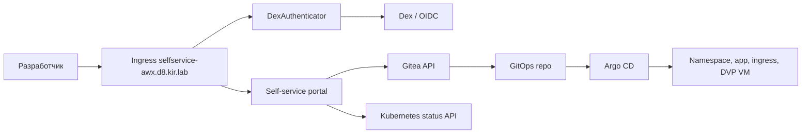

# Self-service портал с Dex/OIDC

Этот вариант показывает developer-facing портал, размещённый в DKP-кластере.

## Адрес

```text
https://selfservice-awx.d8.kir.lab
```

Если DNS не настроен, добавьте на рабочей машине:

```text
10.77.77.208 selfservice-awx.d8.kir.lab
```

## Архитектура



## Пользователи и группы

В демо созданы три пользователя:

| Пользователь | E-mail | Группа | Доступные профили |
| --- | --- | --- | --- |
| `alice-koroleva` | `alice.koroleva@demo.local` | `payments-devs` | `app-only`, `app-with-vm` |
| `boris-smirnov` | `boris.smirnov@demo.local` | `analytics-devs` | `app-only`, `app-with-postgres-vm` |
| `marina-volkova` | `marina.volkova@demo.local` | `qa-devs` | все профили |

Рабочие пароли не хранятся в Git. Для текущего стенда они сохранены локально в `local/self-service-demo-users.md`.

## Как работает заявка

1. Пользователь входит через Dex.
2. Portal получает `X-Auth-Request-User`, `X-Auth-Request-Email`, `X-Auth-Request-Groups`.
3. Пользователь выбирает только разрешённый профиль, purpose, TTL и образ приложения.
4. Имя стенда генерируется автоматически:

```text
dev-<user>-<purpose>-<short-id>
```

5. Backend создаёт в Gitea:

```text
gitops/self-service/requests/<name>.yaml
gitops/self-service/generated/<name>/
```

6. Argo CD применяет generated manifests.
7. Portal читает статус namespace, deployment, ingress и VM через Kubernetes API.

## Что показывает UI

Для каждого профиля портал показывает:

- человеческое описание назначения профиля;
- список создаваемых ресурсов;
- квоты namespace;
- характеристики приложения;
- характеристики VM, если профиль создаёт DVP VM;
- роль AWX post-configuration для VM-профилей.

Назначение стенда тоже описывается явно:

| Purpose | Что означает |
| --- | --- |
| `feature` | Проверка новой функциональности в изолированном namespace. |
| `bugfix` | Воспроизведение дефекта и проверка исправления. |
| `loadtest` | Короткий нагрузочный или ресурсный тест в рамках квот. |
| `demo` | Стенд для показа заказчику, команде или архитектурной аудитории. |

После отправки заявки portal показывает:

- имя заявки;
- имя namespace и его phase;
- owner;
- профиль и purpose;
- TTL;
- квоты;
- параметры `Deployment/demo-app`;
- `Service` и `Ingress`;
- параметры `VirtualDisk` и `VirtualMachine`, если VM создаётся;
- пути GitOps artifacts в Gitea;
- URL приложения.

## Важное ограничение демо

В текущей реализации portal пишет сразу в `main` репозитория Gitea. Это удобно для живого демо.

Production-like вариант должен создавать branch/PR, запускать policy validation, после чего выполнять merge.

## Проверка

```bash
kubectl get dexauthenticator -n self-service-portal
kubectl get certificate -n self-service-portal self-service-portal
kubectl get deploy,svc,ingress -n self-service-portal
kubectl get users.deckhouse.io alice-koroleva boris-smirnov marina-volkova
kubectl get groups.deckhouse.io payments-devs analytics-devs qa-devs
```

После создания стенда через UI:

```bash
kubectl get ns | grep dev-
kubectl get deploy,svc,ingress,vd,vm -n <generated-namespace>
kubectl get application -n argocd demo-platform
```
