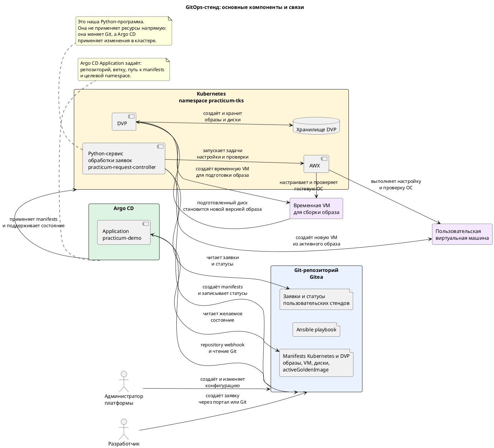
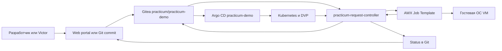

# 01. Архитектура GitOps + DVP + AWX

## Цель

До изменения ресурсов объяснить аудитории весь pipeline и показать, где
настроена каждая связь.

## Крупноблочная схема



## Поток заявки



## 1. Показать Git

Откройте:

```text
http://gitea-practicum.d8case.ru/practicum/practicum-demo
```

Покажите:

```text
gitops/environments/practicum/
gitops/self-service/practicum/requests/
gitops/self-service/practicum/status/
gitops/self-service/practicum/actions/
```

Объяснение:

- `requests` — намерение пользователя;
- `generated` — desired state Kubernetes/DVP;
- `actions` — lifecycle-команды;
- `status` — результат controller, DVP, Argo CD и AWX.

## 2. Показать настройку Argo CD

Откройте:

```text
http://argocd-practicum.d8case.ru
```

Application:

```text
practicum-demo
```

CLI-проверка:

```bash
kubectl get application practicum-demo -n practicum-tks -o yaml |
  sed -n '/source:/,/syncPolicy:/p'
```

Покажите:

- repository URL Gitea;
- target revision `main`;
- path `gitops/environments/practicum`;
- automated sync, prune и self-heal.

Argo CD строит дерево не из README. Оно формируется из owner references,
labels, namespace и фактически применённых Kubernetes-ресурсов.

## 3. Показать controller

```bash
kubectl get deploy practicum-request-controller -n practicum-tks
kubectl logs deploy/practicum-request-controller -n practicum-tks --tail=50
```

Controller:

1. читает `EnvironmentRequest`;
2. проверяет owner, group, profile, TTL и лимиты;
3. создаёт generated manifests через атомарный commit;
4. ждёт готовности приложения и VM;
5. запускает AWX;
6. записывает status обратно в Git.

Это не controller Argo CD. Это отдельный компонент данного demo-проекта.

## 4. Показать AWX

Откройте:

```text
http://awx-practicum.d8case.ru
```

Покажите:

- Project с репозиторием `practicum-demo`;
- Job Template `Practicum Environment Post-Config`;
- Workflow/Jobs golden image;
- inventory host, создаваемый или обновляемый для VM.

Argo CD не выполняет Ansible. AWX запускает playbook, а controller вызывает AWX
API и затем читает статус job.

## 5. Показать DVP

В Web DKP откройте Project `practicum-tks`, затем виртуальные машины и образы.

```bash
kubectl get vi,vd,vm,vmop -n practicum-tks -o wide
```

## Ожидаемый вывод рассказа

> Git хранит намерение и desired state. Controller реализует бизнес-процесс.
> Argo CD синхронизирует Kubernetes/DVP-объекты. DVP исполняет виртуализацию.
> AWX меняет состояние внутри гостевой ОС. Portal только создаёт запрос и
> показывает status, но не удаляет ресурсы напрямую.
