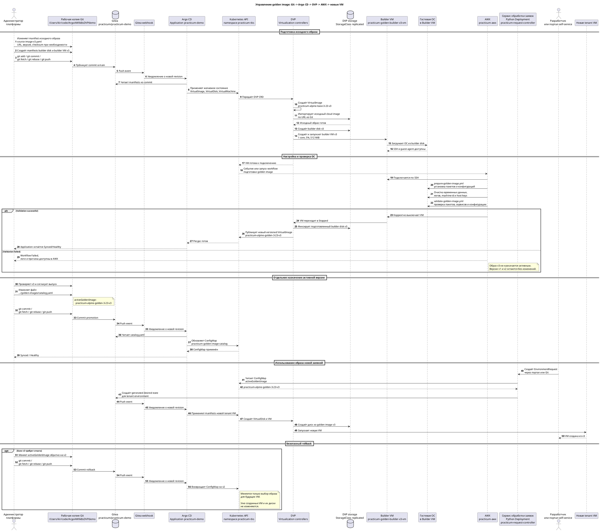

# 02. Управление golden images

## Цель

Показать цепочку:

```text
URL source image в Git
→ Argo CD
→ DVP VirtualImage
→ builder disk и VM
→ AWX prepare/validate/shutdown
→ versioned golden image
→ activeGoldenImage
→ новые tenant VM
```

## Последовательность работы компонентов

Диаграмма показывает полный выпуск новой версии, например `v3`. В текущем
стенде опубликованы и сохранены `v1` и `v2`; `v3` приведена как безопасный
пример следующего выпуска.

Перед любым push в Gitea синхронизируйте рабочую копию с
`practicum-gitea/main`. Это особенно важно для общего demo-репозитория:
controller self-service также пишет в `main` служебные status-коммиты. Никогда
не используйте force-push.



## Исходное состояние

```bash
export NAMESPACE=practicum-tks
export APP_NAME=practicum-demo

kubectl get application "$APP_NAME" -n "$NAMESPACE"
kubectl get vi,vd,vm -n "$NAMESPACE" -o wide
```

## 1. Источник образа

В Gitea откройте:

```text
gitops/environments/practicum/golden-images/source-image.yaml
```

Текущий URL:

```text
https://dl-cdn.alpinelinux.org/alpine/v3.23/releases/cloud/generic_alpine-3.23.3-x86_64-bios-cloudinit-r0.qcow2
```

### Альтернативные source images для демонстрации

Для live-показа лучше использовать небольшие cloud images. Самый безопасный
вариант для текущего стенда — Alpine: импорт быстрый, размер небольшой, AWX
playbooks уже адаптированы.

Пример новой версии на той же ветке Alpine:

```yaml
apiVersion: virtualization.deckhouse.io/v1alpha2
kind: VirtualImage
metadata:
  name: practicum-alpine-base-3-23-v2
  namespace: practicum-tks
spec:
  storage: ContainerRegistry
  dataSource:
    type: HTTP
    http:
      url: https://dl-cdn.alpinelinux.org/alpine/v3.23/releases/cloud/generic_alpine-3.23.3-x86_64-bios-cloudinit-r0.qcow2
```

Пример смены minor-линейки Alpine:

```yaml
apiVersion: virtualization.deckhouse.io/v1alpha2
kind: VirtualImage
metadata:
  name: practicum-alpine-base-3-22-v1
  namespace: practicum-tks
spec:
  storage: ContainerRegistry
  dataSource:
    type: HTTP
    http:
      url: https://dl-cdn.alpinelinux.org/alpine/v3.22/releases/cloud/generic_alpine-3.22.2-x86_64-bios-cloudinit-r0.qcow2
```

Более понятный аудитории, но более тяжёлый вариант — Ubuntu cloud image:

```yaml
apiVersion: virtualization.deckhouse.io/v1alpha2
kind: VirtualImage
metadata:
  name: practicum-ubuntu-base-24-04-v1
  namespace: practicum-tks
spec:
  storage: ContainerRegistry
  dataSource:
    type: HTTP
    http:
      url: https://cloud-images.ubuntu.com/noble/current/noble-server-cloudimg-amd64.img
```

Для короткой демонстрации рекомендуется показывать переход:

```text
Alpine 3.22 → Alpine 3.23
```

или:

```text
Alpine 3.23 v1 → Alpine 3.23 v2
```

Ubuntu лучше оставить как архитектурный пример: он крупнее, дольше
импортируется и может потребовать отдельной адаптации AWX playbooks.

Проверка:

```bash
kubectl get vi practicum-alpine-base-3-23-v1 \
  -n "$NAMESPACE" -o wide
```

Что сказать:

> Администратор задаёт URL и версию в Git. DVP импортирует образ, а не
> использует локальный файл с ноутбука.

## 2. Builder v1 и v2

```bash
kubectl get vd \
  practicum-golden-builder-root \
  practicum-golden-builder-v2-root \
  -n "$NAMESPACE" -o wide

kubectl get vm \
  practicum-golden-builder-vm \
  practicum-golden-builder-v2-vm \
  -n "$NAMESPACE" -o wide
```

Ожидается:

- `1 core`, `5%`, `512Mi`;
- VM `Stopped`;
- disks `Ready`, `InUse=False`.

Builder VM не запускаются для обычной демонстрации: golden images v1/v2 уже
опубликованы. Это экономит ресурсы общего стенда.

## 3. AWX pipeline

В AWX откройте успешный golden image workflow и покажите этапы:

1. prepare;
2. customization;
3. validation;
4. shutdown;
5. publication.

Playbooks находятся в:

```text
gitops/awx/playbooks/prepare-golden-image.yml
gitops/awx/playbooks/validate-golden-image.yml
```

## 4. Опубликованные версии

```bash
kubectl get vi \
  practicum-alpine-golden-3-23-v1 \
  practicum-alpine-golden-3-23-v2 \
  -n "$NAMESPACE" -o wide
```

Обе версии должны оставаться `Ready`. Новая версия создаётся новым объектом,
а не изменением data source уже provisioned image/disk.

## 5. Active image

В Gitea откройте:

```text
gitops/environments/practicum/golden-images/catalog.yaml
```

Проверка:

```bash
kubectl get cm practicum-golden-image-catalog -n "$NAMESPACE" \
  -o jsonpath='{.data.activeGoldenImage}{"\n"}'
```

Ожидается:

```text
practicum-alpine-golden-3-23-v2
```

Controller использует это значение при генерации новой tenant VM.

## 6. Как показать выпуск v3

Не изменяйте v1/v2. Для реального выпуска:

1. создать новые `VirtualDisk` и builder VM с суффиксом `v3`;
2. запустить AWX prepare и validation;
3. опубликовать `practicum-alpine-golden-3-23-v3`;
4. отдельным commit изменить `activeGoldenImage`;
5. создать новый environment и показать, что его диск использует v3.

## Rollback

Rollback не удаляет v2. Отдельным Git commit верните:

```yaml
activeGoldenImage: practicum-alpine-golden-3-23-v1
```

Полный пример:

```bash
git fetch practicum-gitea main
git pull --ff-only practicum-gitea main

$EDITOR gitops/environments/practicum/golden-images/catalog.yaml
git diff
git add gitops/environments/practicum/golden-images/catalog.yaml
git commit -m "Rollback active golden image to v1"
git fetch practicum-gitea main
git rebase practicum-gitea/main
git push practicum-gitea main
```

Если push отклонён с `non-fast-forward`, ещё раз выполните `git fetch`,
`git rebase practicum-gitea/main` и `git push`. Force-push запрещён: он может
удалить commit controller с self-service status.

После синхронизации:

```bash
kubectl get cm practicum-golden-image-catalog -n "$NAMESPACE" \
  -o jsonpath='{.data.activeGoldenImage}{"\n"}'
```

Ожидаемо:

```text
practicum-alpine-golden-3-23-v1
```

Это влияет только на новые VM. Уже созданные VM сохраняют исходный диск.
Такой rollback не пересобирает и не меняет существующие VirtualDisk: это
важное свойство безопасной эксплуатации. Если нужно перевести уже работающий
стенд на другой образ, создавайте новый environment или отдельный controlled
recreate/restore flow.

## Нельзя делать

```bash
# Не выполнять:
kubectl patch vd <provisioned-disk> ...
kubectl delete vi practicum-alpine-golden-3-23-v1 ...
```

У provisioned `VirtualDisk` нельзя менять data source. Для новой версии нужен
новый versioned объект.
