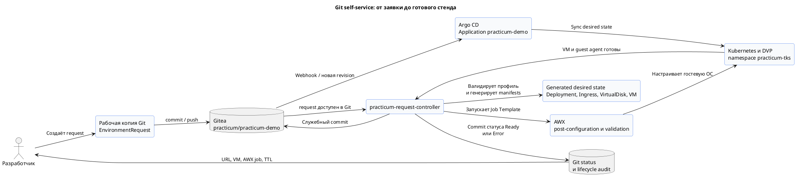
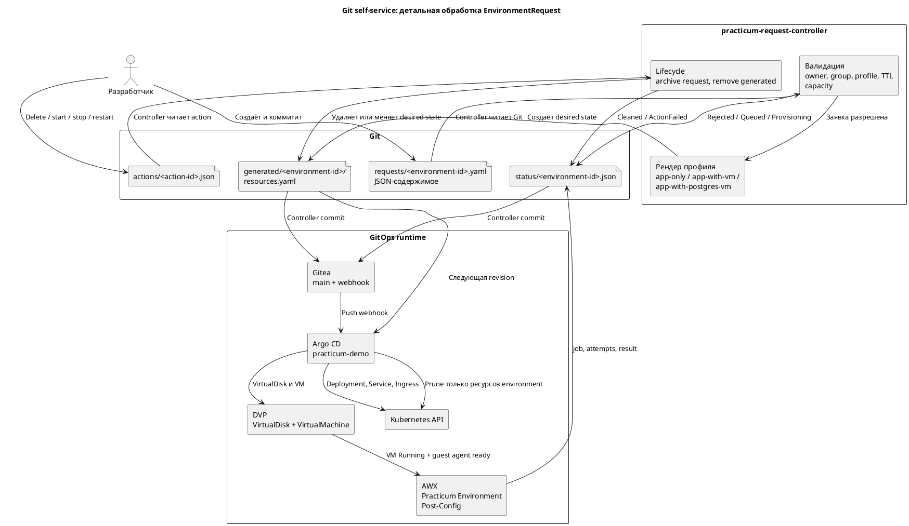
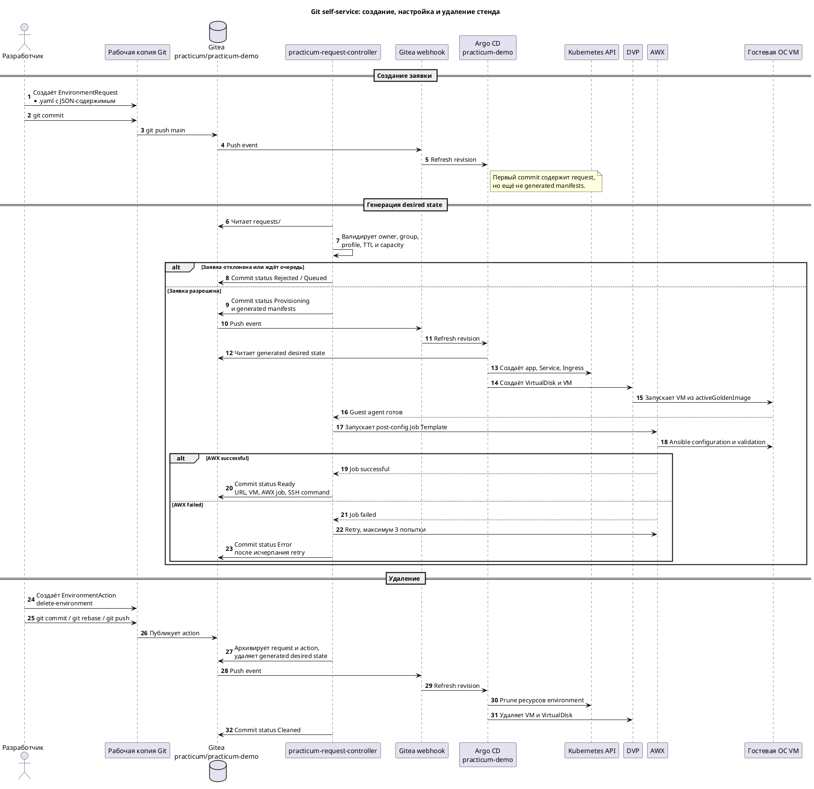

# 03. Self-service через Git и JSON

## Цель

Показать, что разработчик коммитит только декларативную заявку, а controller,
Argo CD, DVP и AWX создают стенд без ручного `kubectl apply`.

Все ресурсы создаются в namespace `practicum-tks`. Новый DKP Project или
namespace для каждой заявки не создаётся.

## Общая блок-схема



## Важное ограничение текущей реализации

Сервис обработки заявок ищет файлы с расширением `.yaml`, но текущая версия
Python-кода читает их содержимое как JSON. Поэтому для этого сценария:

- имя файла должно оканчиваться на `.yaml`;
- содержимое файла должно быть корректным JSON;
- обычный YAML с первой строкой `apiVersion:` использовать нельзя: заявка
  получит статус `Rejected` до создания ресурсов.

Это техническое ограничение текущего демо-стенда. В дальнейшей версии сервиса
следует добавить полноценную поддержку YAML.

## Детальная блок-схема



## Sequence-диаграмма



## 1. Подготовить переменные

```bash
cd /Users/kir/code/ArgoAWXk8sDVPdemo
git fetch practicum-gitea main
git pull --ff-only practicum-gitea main

export NAMESPACE=practicum-tks
export ENV_ID="practicum-env-marina-demo-$(date +%H%M%S)"
export CREATED_AT="$(date -u +%Y-%m-%dT%H:%M:%SZ)"
export REQUEST_FILE="/Users/kir/code/ArgoAWXk8sDVPdemo/gitops/self-service/practicum/requests/${ENV_ID}.yaml"
printf 'Environment ID: %s\nCreated at: %s\nRequest file: %s\n' \
  "$ENV_ID" "$CREATED_AT" "$REQUEST_FILE"
```

Имя должно:

- начинаться с `practicum-env-`;
- содержать только lowercase, цифры и `-`;
- быть не длиннее 63 символов.

## 2. Создать EnvironmentRequest в JSON-формате

Несмотря на расширение `.yaml`, ниже записывается JSON. Не заменяйте фигурные
скобки YAML-отступами.

```bash
cat > "$REQUEST_FILE" <<EOF
{
  "apiVersion": "demo.practicum/v1",
  "kind": "EnvironmentRequest",
  "metadata": {
    "name": "${ENV_ID}"
  },
  "spec": {
    "owner": "marina-volkova-practicum",
    "email": "marina.volkova.practicum@demo.local",
    "groups": ["practicum-qa-devs"],
    "profile": "app-with-vm",
    "purpose": "demo",
    "ttl": "2h",
    "createdAt": "${CREATED_AT}"
  }
}
EOF

jq . "$REQUEST_FILE"
```

Разрешённые профили:

| Profile | Результат |
|---|---|
| `app-only` | Deployment, Service, Ingress |
| `app-with-vm` | приложение и минимальная Linux VM |
| `app-with-postgres-vm` | приложение, VM и PostgreSQL post-config |

Для PostgreSQL добавьте:

```json
"postgresql": {"version": "18"}
```

Поддерживаются версии `16`, `17`, `18`.

## 3. Commit и push

```bash
git add "$REQUEST_FILE"
git commit -m "Request practicum environment ${ENV_ID}"

# Controller также пишет в main. Перед push переносим свой commit
# поверх актуальной истории Gitea и никогда не используем force-push.
git fetch practicum-gitea main
git rebase practicum-gitea/main
git push practicum-gitea main
```

GitHub является копией проекта, но live Argo CD читает Gitea.

Если Gitea отклонил push с `non-fast-forward`, повторите `git fetch`,
`git rebase practicum-gitea/main` и `git push`. При конфликте остановитесь и
разберите конфликт; `git push --force` запрещён.

## 4. Наблюдать Git

В Gitea покажите появление:

```text
gitops/self-service/practicum/requests/<environment-id>.yaml
gitops/environments/practicum/self-service/generated/<environment-id>/
gitops/self-service/practicum/status/<environment-id>.json
```

Controller может создать несколько status-коммитов. Это штатно.

## 5. Наблюдать Argo CD

```bash
while true; do
  clear
  date
  kubectl get application practicum-demo -n "$NAMESPACE" \
    -o custom-columns=NAME:.metadata.name,SYNC:.status.sync.status,HEALTH:.status.health.status,REVISION:.status.sync.revision
  sleep 5
done
```

Остановить просмотр: `Ctrl+C`. В UI Argo CD найдите ресурсы по Environment ID.

## 6. Наблюдать Kubernetes/DVP

```bash
while true; do
  clear
  date
  kubectl get deploy,svc,ingress,vd,vm -n "$NAMESPACE" \
    -l "demo.practicum/environment=${ENV_ID}" \
    --request-timeout=10s
  sleep 5
done
```

Пока сервис обработки заявок не создал generated manifests, команда покажет
`No resources found`. После обработки заявки она начнёт показывать Deployment,
Service, Ingress, VirtualDisk и VirtualMachine. Остановить просмотр: `Ctrl+C`.

Для VM:

```bash
kubectl get vm "${ENV_ID}-vm" -n "$NAMESPACE" -o wide
```

## 7. Наблюдать AWX

В AWX откройте Job Template:

```text
Practicum Environment Post-Config
```

Controller запустит job после готовности VM и guest agent.

## 8. Прочитать итоговый status

```bash
git fetch practicum-gitea main
git show "FETCH_HEAD:gitops/self-service/practicum/status/${ENV_ID}.json" | jq .
```

Сервис обработки заявок создаёт отдельные status-коммиты в Gitea. Для их
просмотра не нужен `git pull --rebase`: он не выполнится при незакоммиченных
изменениях в рабочей копии. `git fetch` получает актуальную версию ветки, а
`git show FETCH_HEAD:...` читает status напрямую из неё, не изменяя файлы на
ноутбуке.

Ожидается:

- `state: Ready`;
- приложение `ready 1/1`;
- VM `Running`;
- IP VM;
- AWX `successful`;
- команда `d8 v ssh`.

## 9. Доступ

```bash
kubectl get ingress "$ENV_ID" -n practicum-tks

d8 v ssh "ansible@${ENV_ID}-vm" \
  --namespace "$NAMESPACE" \
  --identity-file local/practicum-ssh/id_ed25519 \
  --local-ssh
```

## Если ранее отправлен обычный YAML

Не исправляйте уже отклонённую заявку во время показа: она полезна как
диагностический след. Создайте новую заявку с новым `ENV_ID` по шагам выше.
Так аудитория увидит чистый успешный путь, а в Git сохранится причина ошибки
предыдущего запуска.

## Cleanup

Удаляйте стенд через портал пользователя или Victor либо через отдельный
`EnvironmentAction` в Git. Не удаляйте request и generated-каталог вручную во
время демонстрации: lifecycle должен остаться аудитируемым. После action
controller архивирует request/action, удаляет generated desired state, а Argo
CD выполняет prune только ресурсов выбранного Environment ID.
